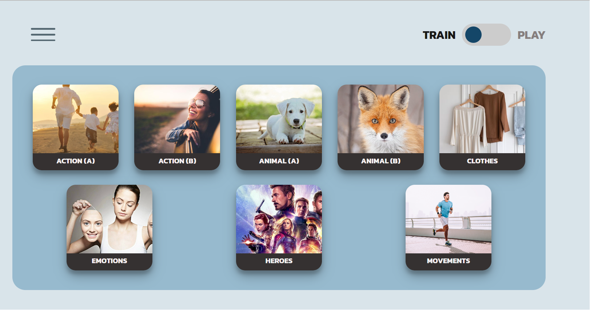
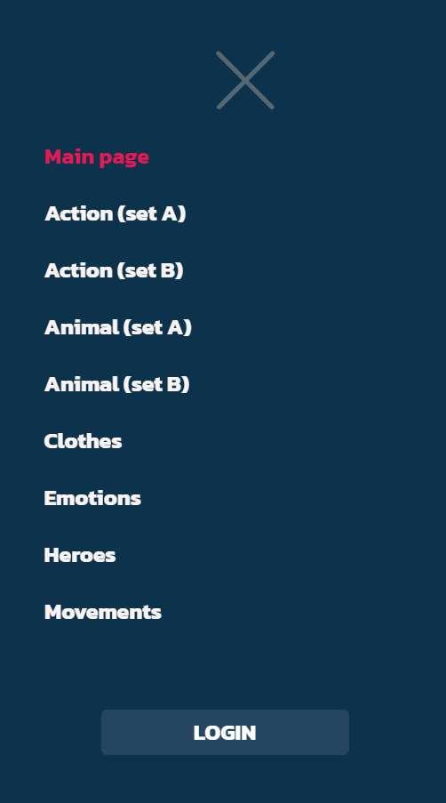
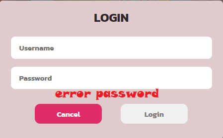
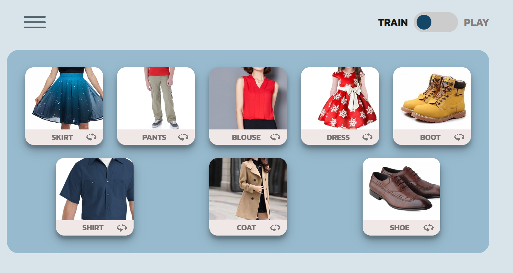
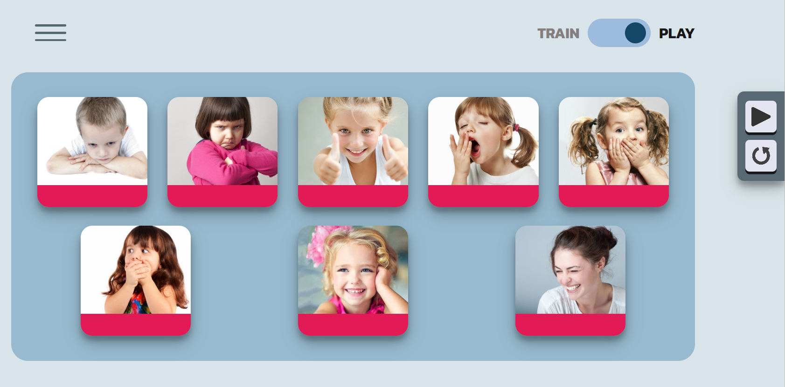

### Содержание
  1. [Введение](#1)
  2. [Объект тестирования](#2)
  3. [Атрибуты качества](#3)
  4. [Риски](#4)
  5. [Аспекты тестирования](#5) 
  6. [Подходы к тестированию и их реализация](#6)
  7. [Выводы](#7)

### 1. Введение

Данный план предназначен для тестирования приложения "English-for-kids". Цель проведения тестирования - проверка работоспособности и пригодности приложения для практического использования ручным способом, а также автоматическое тестировани отдельных компонентов пользовательского интерфейса и их совместного использования

### 2. Объект тестирования

В качестве объектов тестирования можно выделить атрибуты качества платформы по ISO 25010:

1. функциональность

	- функциональная полнота: приложение должно выполнять все заявленные функции
	- функциональная корректность: приложение должно выполнять все заявленные функции корректно
	- функциональная целесообразность: отсутствуют не заявленные функции, которые бы мешали приложению выполнять первоначально поставленные задачи

2. удобство использования

	- эстетика пользовательского интерфейса: элементы управления объектами должны быть всегда доступны пользователю
	- уведомление пользователя о неправильных действиях: приложение должно сообщать пользователю об ошибках и о неправильном использовании

### 3. Атрибуты качества

1. Функциональность:

    - функциональная полнота: приложение должно соответствовать всем функциональным требованиям, заявленных в SDS;
    - функциональная целесообразность: отсутствуют не заявленные функции, которые бы мешали приложению выполнять поставленные задачи
    
2. Удобство использования:

    - простота пользовательского интерфейса: интерфейс должен быть достаточно простым для интуитивного использования новым пользователем
    
3. Кроссплатформенность:

    - корректная работа приложения на платформах:
      - Windows
      - Linux.
      
4. Адаптивность

    - возможность комфортного использования приложения как на компьютере.

### 4. Риски
Приложение не использует функций и особенностей конкретных веб-браузеров, возможно использование во всех веб-браузерах , указанных в SRS, начиная с указанных версий.

### 5. Аспекты тестирования

Для проведения тестирования приложения необходимо определить каким образом оно будет происходить. Для лучшего понимания рассмотрим основные виды тестирования.

1. Автоматизированное тестирование
2. Ручное тестирование

Автоматизированное тестирование программного обеспечения — часть процесса тестирования на этапе контроля качества в процессе разработки программного обеспечения. Оно производится с помощью специальных библиотек и фреймворков для тестирования.

Ручное тестирование — часть процесса тестирования на этапе контроля качества в процессе разработки программного обеспечения. Оно производится тестировщиком без использования программных средств, для проверки программы или сайта путём моделирования действий пользователя.

Автоматизированное тестирование можно разделить на несколь подвидов:

1. Юнит тестирование
2. Интеграционное тестирование
3. Енд-ту-енд тестирование

Юнит тестирование проводится для тестирования отдельных блоков или компонентов приложения в полной изоляции.
Интеграционное тестирование проводится для тестирования работы взаимодействия отдельных компонентов приложения.
Енд-ту-енд тестирование это полноценное тестирование приложение с имитацией всех возможных действий пользователя на странице.

Данное приложение будет тестироваться ручным способом, а также автоматизированно с помощью юнит и интеграционных тестов.

### 6. Подходы к тестированию и их реализация

Проведём тестировани тестирование процесса регистрации ручным способом при запуске приложения локально:

Для запуска приложения переходим по ссылке https://rolling-scopes-school.github.io/saugene-JSFE2021Q1/english-for-kids/ и попадаем на главную страницу приложения. 

На главной странице мы видим, выпадающее меню и два различных режима: режим тренировки, где пользователь изучает новые слова и режим игры, где пользователь тренируется в запоминании.

Слева от полей ввода есть меню где пользоавель может сменить изучаемый материал, а так же авторизоваться для сохранения результата.

Если данные будет введены неверно, т.е. не будут соответствовать схеме, указанной в SRS, то под полями ввода должны появиться собщения об ошибке ввода.

После нажатия на любую тренировку, будет произведена смена текущих слов на слова из новой тематики.

После нажатия на кнопку "play" будет изменен режим, где все слова уже будут не видны, а лишь будут произноситься системой, и вам нужно по картинке определить это слово.

Как упомяналось выше представлены юнит. Как среда для запуска юнит тестов был использован JS. Для реализации тестов были использованы средства фреймворка QUnit.

Рассмотрим юнит тесты:

Для того чтобы протестировать данный компонент нужно проверить следующие варианты
его поведения:
- переход по всем возможным url-адресам
- отрисовка всех иконок
- авторизация пользователя при корректно заполненных полях
- ошибка авторизации при некорректно введенных данных

### 7. Выводы
Данный тестовый план позволяет протестировать основной функционал приложения. Успешное прохождение всех тестов не гарантирует полной работоспособности на всех платформах и архитектурах, однако позволяет полагать, что данное программное обеспечение работает корректно.
